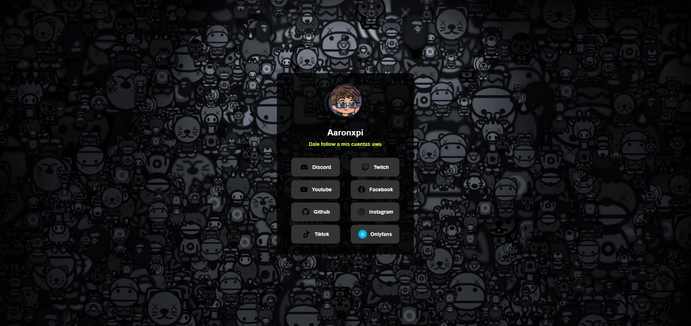

# Frontend Mentor - Social links profile



## Welcome! 👋

Thanks for checking out this front-end coding challenge.

[Frontend Mentor](https://www.frontendmentor.io) challenges help you improve your coding skills by building realistic projects.

**To do this challenge, you need a basic understanding of HTML and CSS.**
## Table of contents

- [Overview](#overview)
  - [The challenge](#the-challenge)
  - [Links](#links)
- [My process](#my-process)
  - [Built with](#built-with)
  - [What I learned](#what-i-learned)
  - [Continued development](#continued-development)
  - [Useful resources](#useful-resources)
- [Author](#author)
- [Acknowledgments](#acknowledgments)


### The challenge

Your challenge is to build out this social links profile and get it looking as close to the design as possible.

You can use any tools you like to help you complete the challenge. So if you've got something you'd like to practice, feel free to give it a go.

Your users should be able to: 

- See hover and focus states for all interactive elements on the page

Want some support on the challenge? [Join our community](https://www.frontendmentor.io/community) and ask questions in the **#help** channel.

### Links

- Live Site: [click here to see prra :v](https://xpilinks.netlify.app/)

## My process

### Built with

- Semantic HTML5 markup
- CSS custom properties
- Flexbox
- CSS Grid

### What I learned

use an animation in the "li" for the hover function

```html
 <ul class="social-media">
          <li><a href="https://discord.gg/nvH7JyyfAD" target="_blank">Discord</a></li>
          <li><a href="https://www.twitch.tv/aaronxpi" target="_blank">Twitch</a></li>
          <li><a href="https://www.youtube.com/@Aaronxpi" target="_blank">Youtube</a></li>
  </ul>
```
```css
.profile .social-media li:hover a { 
    animation: border-rotate 2s infinite;
    background-color: rgba(0, 183, 255, 0.527);
    color: var(--clr-grey);
    border-width: 4px;
}
```
```css
@keyframes border-rotate { 
    0% { border-color: rgba(255, 0, 0, 0.575); } 
    25% { border-color: rgba(255, 255, 0, 0.61); } 
    50% { border-color: rgba(0, 128, 0, 0.541); } 
    75% { border-color: rgba(0, 0, 255, 0.39); } 
    100% { border-color: rgba(255, 0, 0, 0.384); } 
}
```

### Useful resources

- [Example from Fronted Mentor](https://www.frontendmentor.io/challenges/social-links-profile-UG32l9m6dQ) - He helped me with the base of the project and then I started to modify it in my own way.

## Author

- Frontend Mentor - [@AaronxpiDev](https://www.frontendmentor.io/profile/AaronxpiDev)
- Twitch - [@Aaronxpi](https://www.twitch.com/aaronxpi)

## Acknowledgments

thank you fronted mentor....
